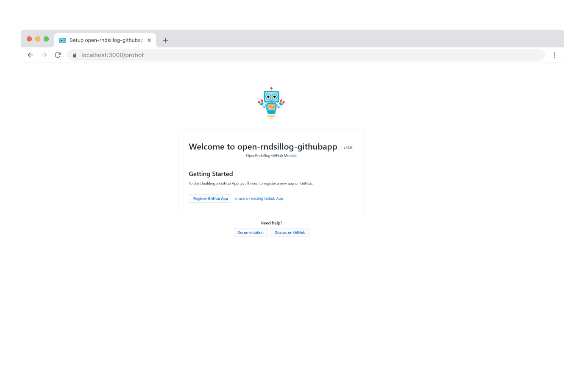

# indulgentia-github

> [Probot](https://github.com/probot/probot)으로 구축된 GitHub 앱 "indulgentia-github" GitHub 모듈

## 설정 전 준비사항
다음 정보가 필요합니다:
1. Azure Blob Storage
   - CONNECTION_STRING
   - CONTAINER_NAME
2. Supabase
   - SUPABASE_URL
   - SUPABASE_KEY
3. indulgentia-back URL

## 설정

### indulgentia-github 등록

1. "indulgentia-github"을 등록하세요.

```sh
# 의존성 설치
npm install

# 봇 실행
npm start
```

2. http://localhost:3000을 방문하여 다음과 같은 화면을 확인하세요:



3. GitHub 앱 등록 버튼을 클릭하세요.
4. 고유한 "indulgentia-github" 이름을 설정하세요.
5. GitHub 앱을 등록한 후, 앱을 설치할 저장소로 리디렉션됩니다. 로컬 .env 파일은 리디렉션 중 GitHub에서 전송된 값으로 채워집니다.
6. "indulgentia-github"을 시작하기 전에 .env (또는 도커 환경 변수)를 다음과 같이 설정해야 합니다:

```.env
# Azure
CONNECTION_STRING=<blob-storage-connection-string>
CONTAINER_NAME=<blob-storage-container-name>

# Supabase
SUPABASE_URL=<supabase-URL>
SUPABASE_KEY=<supabase-service_role-key>

# API 서버
API_SERVER_URL=<indulgentia-back-URL>
``` 
> **(정보)** "indulgentia-github"을 "indulgentia-front" 및 "indulgentia-back"와 별도로 "open-rndsillog-network"를 수정하여 설정할 수 있습니다.

7. 이제 준비가 완료되었습니다! "open-rndsillog-network"의 지침을 따르세요.

### Docker 사용 시작

```sh
# 1. 컨테이너 빌드
docker build -t indulgentia-github .

# 2. 컨테이너 시작
docker run -e APP_ID=<app-id> -e PRIVATE_KEY=<pem-value> indulgentia-github
```

## 기여

"indulgentia-github"을 개선할 수 있는 제안이나 버그 신고가 있다면 이슈를 열어주세요! 모든 기여를 환영합니다.

자세한 내용은 [기여 가이드](CONTRIBUTING.md)를 확인하세요.

## 라이선스

[ISC](LICENSE) © 2024 Changwoo Lim
